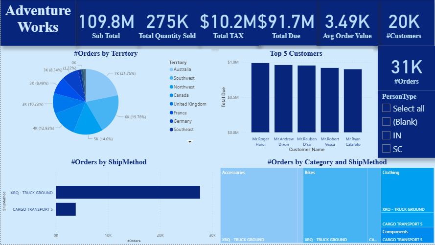
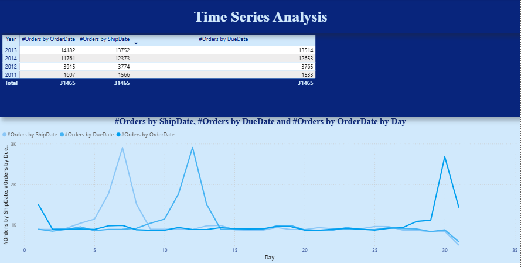

# AdventureWorks_Sales_Analysis
## Project Overview
This project focuses on analyzing the Adventure Works sales dataset to uncover key business insights and performance trends.  
The analysis was performed entirely in **Power BI**, using data modeling, DAX measures, and visual storytelling techniques to highlight important business patterns.

---

## Tools & Technologies
- Power BI – Data visualization and dashboard building
- DAX – Creating calculated measures and KPIs
- Star Schema Data Model – Optimized structure for performance and easy analysis

---

## Data Model
A **Star Schema** was designed to organize the data efficiently:
- **Fact Table:** Sales
- **Dimension Tables:** Customer, Product, Territory, Date, and ShipMethod

This model improved performance, enabled advanced relationships, and simplified DAX calculations.

---

## Dashboard Overview
The dashboard includes the following main sections:
- **KPI Cards:** Sub Total, Total Quantity Sold, Total Tax, Total Due, Average Order Value, and Number of Customers and Orders  
- **Orders by Territory:** Pie chart showing sales distribution across regions  
- **Top 5 Customers:** Bar chart displaying customers with the highest total due  
- **Orders by Ship Method:** Bar chart comparing delivery performance  
- **Orders by Category and Ship Method:** Tree map for product and shipping insights  
- **Time Series Analysis:** Line chart tracking orders by Order Date, Ship Date, and Due Date

---

## Insights & Analysis

1. **Sales Performance:**
   - The total **Sub Total reached 109.8M** with over **275K items sold**.
   - End-of-month peaks indicate strong customer activity at the end of each period.

2. **Regional Insights:**
   - **Australia** and **Southwest regions** account for the majority of total orders, suggesting a higher customer concentration there.

3. **Customer Insights:**
   - Top customers such as **Mr. Roger Harui** and **Mr. Andrew Dixon** generate the highest total due amounts, representing valuable long-term clients.

4. **Shipping Insights:**
   - The **“XRQ - Truck Ground”** method handles the majority of orders, showing its reliability and preference among customers.

5. **Time Series Analysis:**
   - Noticeable order spikes around the **10th and 30th day** of each month, possibly due to promotional events or salary cycles.

---

## Key Takeaways
This project demonstrates:
- Strong ability to design intuitive dashboards in Power BI
- Proficiency in data modeling using Star Schema
- Skills in identifying business insights from sales data
- Effective visualization and storytelling through data

---

## Project Files
- `AdventureWorks_Sales_Analysis.pbix` → Power BI dashboard  
- `README.md` → Project documentation

---

## Author
**Aya Gamal**  
 [LinkedIn](linkedin.com/in/aya-gamal-senara)
